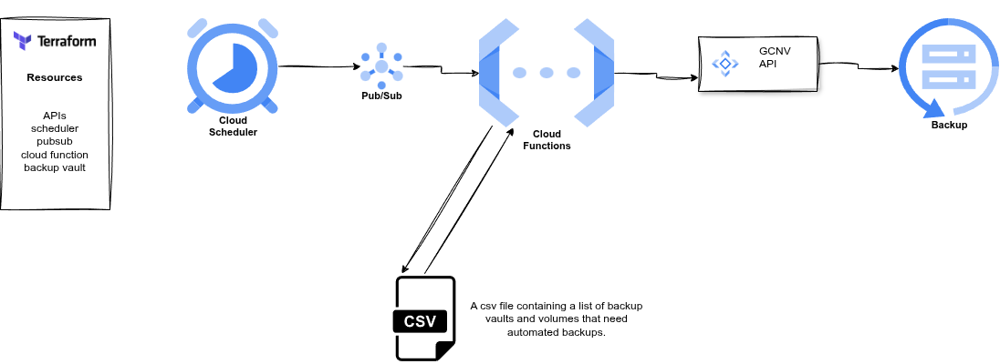

-----

# Multi-Volume NetApp Scheduled Backups with Google Cloud Functions

This repository provides a Google Cloud Function that automates the creation and management of NetApp volume backups across multiple volumes. It uses a **CSV file** to define volumes and their corresponding backup vaults, ensuring backups are scheduled on a preconfigured routine.

Each backup is **labeled for easy identification**. To manage storage, if the number of backups for any volume exceeds the configured limit (default is 24), the oldest backup is deleted before a new one is created. The function is triggered regularly by **Cloud Scheduler** through a **Pub/Sub topic**.

-----

## How It Works

### Architecture Diagram

The diagram below illustrates how the components interact to provide automated multi-volume backups:




  * **Terraform Deployment**: Resources such as storage pools, volumes, backup vaults, and API configurations are deployed using Terraform.
  * **Scheduled Trigger**: Cloud Scheduler triggers the Cloud Function via a Pub/Sub topic based on a defined cron schedule.
  * **Cloud Function Operation**:
      * The Cloud Function reads a **CSV file** containing a list of volumes and their associated backup vaults.
      * For each entry in the CSV, the function uses the **NetApp API** to create a backup.
      * Each backup is **labeled** for identification.
      * If backups exceed the retention limit (default is 24), the oldest backup is deleted before a new one is created.

-----

## Prerequisites

### APIs

The following Google Cloud APIs need to be enabled in your project:

  * **Cloud Functions API**
  * **Cloud Build API**
  * **Pub/Sub API**
  * **NetApp API**
  * **Cloud Scheduler API**

*Note: The `apis.tf` file automatically enables these APIs through Terraform.*

### Permissions

The user needs to have the **Google Cloud NetApp Volumes "NetApp Admin" role** to use this script successfully.

*Note: If deploying through Terraform, the Terraform service account needs this role. The `iam.tf` file automatically grants the service account this role through Terraform.*

-----

## Usage

### 1\. Clone the Repository

```bash
git clone https://github.com/oreade97/Netapp-Scheduled-Backups.git
```

### 2\. Configure Terraform Variables

Navigate to the `Terraform Files` folder. Create a `.tfvars` file to store the following variables:

| Variable                    | Description                                                                 |
| :-------------------------- | :-------------------------------------------------------------------------- |
| `project_id`                | Your Google Cloud project ID                                                |
| `region`                    | The region where NetApp resources exist and the function will be deployed   |
| `service_account_key_file`  | The file containing your service account keys                               |
| `backup_schedule`           | Frequency and time of backup in cron format (e.g., `0 0 * * *` for daily) |
| `volume_path`           | path to the CSV file e.g, "volumes.csv" |

**Important**: For multi-volume backup functionality, the volume name and backup vault name are now determined by the CSV file. Therefore, the `volume_name` and `backup_vault_name` variables are no longer used.

Open the `backup.tf` file and update the `location` variable to match the region where your volumes are located.

### 3\. Configure the Backup Function

Navigate to the `Backup Function` folder. Edit the `main.py` file (or your preferred configuration file) to set the following variables:

| Variable           | Description                               |
| :----------------- | :---------------------------------------- |
| `BACKUP_LABEL_KEY` | Label key for the scheduled backups       |
| `BACKUP_LABEL_VALUE` | Label value for the scheduled backups     |
| `MAX_BACKUPS`      | Total number of backups to keep (default: 24) |

#### CSV File Configuration:

Add a CSV file (e.g., `volumes.csv`) to the Cloud Function package. The CSV should list the volumes and their corresponding backup vaults in the following format:

```csv
volume_name,backup_vault_name
volume1,vaultA
volume2,vaultB
...
```

This file allows the Cloud Function to determine which volumes to back up and the corresponding backup vault for each.

Once all modifications are made, compress the contents of the `Backup Function` folder into a ZIP archive. Name this archive `backup.zip` (or use the name specified in your Terraform configuration under `cloudfunction.tf`).

### 4\. Deploy with Terraform

Initialize Terraform in the directory containing your Terraform files:

```bash
terraform init
```

Run a Terraform plan to preview the resources to be created:

```bash
terraform plan
```

Apply the plan to deploy the resources:

```bash
terraform apply
```

-----

## Contributions

Contributions are welcome\! If you have any suggestions, improvements, or bug fixes, please feel free to open an issue or submit a pull request in this repository.

-----

## Summary

This solution effectively leverages a CSV file to enable automated multi-volume backups for NetApp. The Cloud Function reads the CSV, creates backups for each listed volume, and enforces a retention policy by deleting the oldest backups when the maximum number is exceeded.
